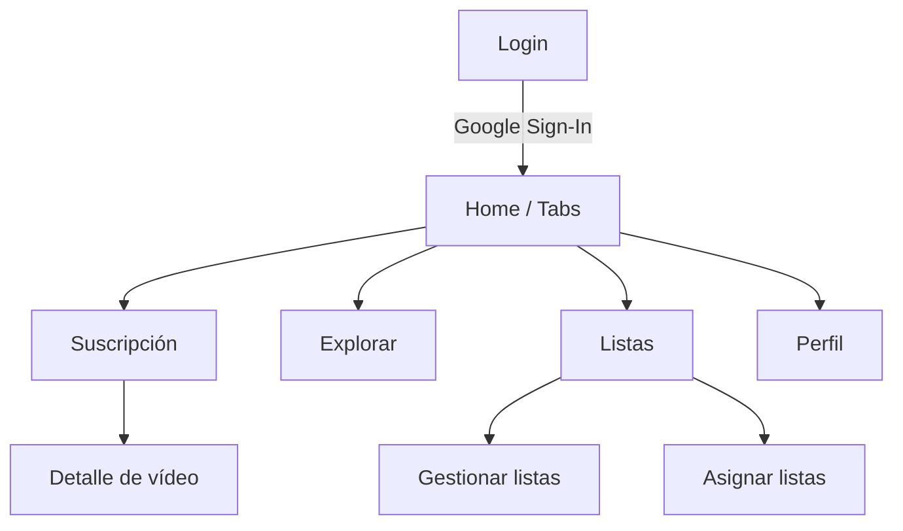

# ARIS

Flutter app that lists the most recent videos from your YouTube subscriptions.

## Mapa visual de pantallas



## Páginas (tabla rápida)

| Pantalla | Qué muestra | Acciones clave | Archivo |
| --- | --- | --- | --- |
| Login | Acceso con Google y estados de carga/error | Iniciar sesión | `lib/screens/login_screen.dart` |
| Home / Tabs | Contenedor con navegación y chip de cuota | Cambiar pestañas, abrir perfil | `lib/main.dart` |
| Suscripción | Lista de vídeos recientes | Refrescar, abrir detalle | `lib/screens/videos_screen.dart` |
| Detalle de vídeo | Reproductor + resumen IA | Elegir pista, resumir | `lib/screens/video_detail_screen.dart` |
| Listas | Suscripciones y listas locales | Crear/editar listas, asignar canales | `lib/screens/lists_screen.dart` |
| Explorar | Placeholder | Ninguna | `lib/screens/explore_screen.dart` |
| Perfil | Configurar proveedor IA y cerrar sesión | Elegir proveedor, modelo y API key | `lib/screens/profile_screen.dart` |

## Páginas (detalle)

### Login

Pantalla de acceso que muestra el botón de Google y los estados de carga/error. Si no hay token válido, la app se queda aquí. `lib/screens/login_screen.dart`.

### Home / Tabs

Contenedor de navegación con tres pestañas. También muestra el chip de cuota estimada y el acceso a Perfil. Usa `IndexedStack` para mantener estado al cambiar de pestaña. `lib/main.dart`.

### Suscripción

Muestra los vídeos recientes de tus suscripciones. Al entrar, llama a `fetchRecentVideosFromSubscriptions` y pinta un `ListView` con miniatura, título, canal y fecha local. Solo se trae el último vídeo por canal y luego se ordena por `publishedAt` descendente. Tiene pull-to-refresh y abre el detalle al tocar un item. `lib/screens/videos_screen.dart`.

### Detalle de vídeo

Reproductor embebido del vídeo seleccionado. Permite cargar pistas de subtítulos, elegir la pista (por defecto español si existe) y generar una transcripción; luego llama al proveedor IA configurado en Perfil para obtener un resumen. `lib/screens/video_detail_screen.dart`.

### Listas

Carga todas las suscripciones y permite organizar canales en listas locales. Las listas se crean/editar/eliminan en un modal, y la asignación de canales a listas se gestiona en otro modal. Todo se guarda en `SharedPreferences`. `lib/screens/lists_screen.dart`.

### Explorar

Pantalla placeholder sin lógica de negocio todavía. `lib/screens/explore_screen.dart`.

### Perfil

Pantalla de configuración del proveedor IA (ChatGPT, Gemini, Antrophic, Grok), modelo y clave API. También contiene el botón de cerrar sesión. `lib/screens/profile_screen.dart`.

## Peticiones y cuota por página (visual)

> La app usa una **cuota estimada local**: cada petición a YouTube Data API suma 1 unidad en `QuotaTracker`. Esto **no equivale** a la cuota real oficial de YouTube Data API, pero sirve para tener una referencia interna.

### Login

Qué hace: inicia sesión con Google y obtiene token OAuth.

| Petición | Endpoint | Cuota estimada |
| --- | --- | --- |
| OAuth Google | Flujo de Google Sign-In | 0 (no es YouTube Data API) |

### Home / Tabs

Qué hace: navegación y muestra chip de cuota.

| Petición | Endpoint | Cuota estimada |
| --- | --- | --- |
| Ninguna | - | 0 |

### Suscripción

Qué hace: lista el último vídeo de cada canal (hasta 20 canales) y los ordena por fecha.

| Petición | Endpoint | Cuota estimada |
| --- | --- | --- |
| Suscripciones | `youtube/v3/subscriptions?part=snippet&mine=true&maxResults=50` | 1 |
| Canales | `youtube/v3/channels?part=contentDetails&id=...` | 1 |
| Último vídeo por canal (máx. 20) | `youtube/v3/playlistItems?part=snippet&playlistId=...&maxResults=1` | 1 por canal |

Cuota estimada total: `2 + N`, donde `N = min(20, canales con uploads)`.

### Listas

Qué hace: carga todas las suscripciones y permite asignarlas a listas locales con icono.

| Petición | Endpoint | Cuota estimada |
| --- | --- | --- |
| Suscripciones (paginado) | `youtube/v3/subscriptions?part=snippet&mine=true&maxResults=50&pageToken=...` | 1 por página |

Cuota estimada total: `P`, donde `P = número de páginas (50 suscripciones por página)`.

### Detalle de vídeo

Qué hace: reproduce el vídeo, descarga subtítulos y genera un resumen IA.

| Petición | Endpoint | Cuota estimada |
| --- | --- | --- |
| Player | IFrame de YouTube | 0 (no Data API) |
| Extraer key + metadata | `GET /watch?v=...` y `POST /youtubei/v1/player` | 0 (no Data API) |
| Descargar subtítulos | `GET baseUrl` (XML) | 0 (no Data API) |
| Resumen IA | OpenAI / Gemini / Anthropic / Grok | 0 (no YouTube Data API) |

### Explorar

Qué hace: placeholder.

| Petición | Endpoint | Cuota estimada |
| --- | --- | --- |
| Ninguna | - | 0 |

### Perfil

Qué hace: guarda proveedor, modelo y clave API.

| Petición | Endpoint | Cuota estimada |
| --- | --- | --- |
| Ninguna | SharedPreferences | 0 |

## Flujo de vídeos (diagrama)

```mermaid
flowchart LR
  A[GoogleAuthService] -->|Access token| B[YouTubeApiService]
  B --> C[GET subscriptions]
  C --> D[Channel IDs]
  D --> E[GET channels contentDetails]
  E --> F[Uploads playlist IDs]
  F --> G[GET playlistItems maxResults=1]
  G --> H[YouTubeVideo]
  H --> I[Ordenar por publishedAt desc]
  I --> J[ListView en Suscripción]
```



## Lógica de negocio (resumen visual)

| Regla / decisión | Resultado | Archivo |
| --- | --- | --- |
| Sin token no se llama a la API | Se bloquea la app en Login | `lib/auth/google_auth_service.dart`, `lib/main.dart` |
| Se toma solo el último vídeo por canal | Feed compacto por canal | `lib/services/youtube_api_service.dart` |
| Orden por fecha de publicación descendente | Los más nuevos arriba | `lib/services/youtube_api_service.dart` |
| Fecha se muestra en zona local | Formato `dd/MM/yyyy` | `lib/screens/videos_screen.dart` |
| Pista de subtítulos por defecto en español si existe | Mejora de UX para ES | `lib/screens/video_detail_screen.dart` |
| Transcripción vía youtubei + baseUrl | No usa Data API para subtítulos | `lib/services/youtube_transcript_service.dart` |
| Resumen IA usa proveedor del Perfil | Llama a OpenAI/Gemini/Anthropic/Grok | `lib/services/ai_summary_service.dart` |
| Listas son locales (SharedPreferences) | No filtra vídeos aún | `lib/storage/subscription_lists_store.dart` |

## Persistencia de datos (local)

La app no usa base de datos externa. Todo lo persistente se guarda en `SharedPreferences` (almacenamiento local).

| Dato | Dónde se guarda | Archivo |
| --- | --- | --- |
| Listas y asignaciones | `subscription_lists_state` | `lib/storage/subscription_lists_store.dart` |
| Configuración IA (proveedor, modelo, API key) | `ai_provider_settings` | `lib/storage/ai_settings_store.dart` |
| Cuota diaria (usado, breakdown, fecha) | `youtube_quota_state` | `lib/services/quota_tracker.dart` |
| Caché de transcripciones (TTL 2 días) | `expiring_cache:transcripts:*` | `lib/storage/expiring_cache_store.dart` |
| Caché de resúmenes IA (TTL 2 días) | `expiring_cache:summaries:*` | `lib/storage/expiring_cache_store.dart` |

Notas:
1. Las claves de la caché expiran automáticamente cuando se supera el TTL.
2. La cuota se reinicia al cambiar el día local.

## Cuota estimada (unidades)

| Acción | Unidades | Dónde se suma |
| --- | --- | --- |
| Lecturas básicas (subscriptions, channels, playlistItems) | 1 | `lib/services/youtube_api_service.dart` |
| Transcripción (youtubei + baseUrl) | 0 (no consume Data API) | `lib/services/youtube_transcript_service.dart` |
| Resumen IA (proveedores externos) | 0 (no YouTube Data API) | `lib/services/ai_summary_service.dart` |
| Persistencia diaria | Reinicia por día | `lib/services/quota_tracker.dart` |

## Setup (Android)

1) Create OAuth 2.0 credentials for an Android app in Google Cloud Console.
   - Package name: `com.aris` (or change `applicationId` in `android/app/build.gradle.kts`)
   - Add SHA-1 for your debug keystore:
   ```
   keytool -list -v -keystore %USERPROFILE%\.android\debug.keystore -alias androiddebugkey -storepass android -keypass android
   ```
2) Enable **YouTube Data API v3** in the same project.
3) Download `google-services.json` and place it here:
   - `android/app/google-services.json`
4) Create a **Web OAuth Client ID** in Google Cloud.
   - This repo already embeds a default Web Client ID for local use.
   - You can override it at runtime with:
   ```
   flutter run --dart-define=GOOGLE_SERVER_CLIENT_ID=YOUR_WEB_CLIENT_ID
   ```

## Run

```
flutter pub get
flutter run
```

## Notes

- Google Sign-In is supported on Android/iOS/Web. Windows desktop is not supported.
