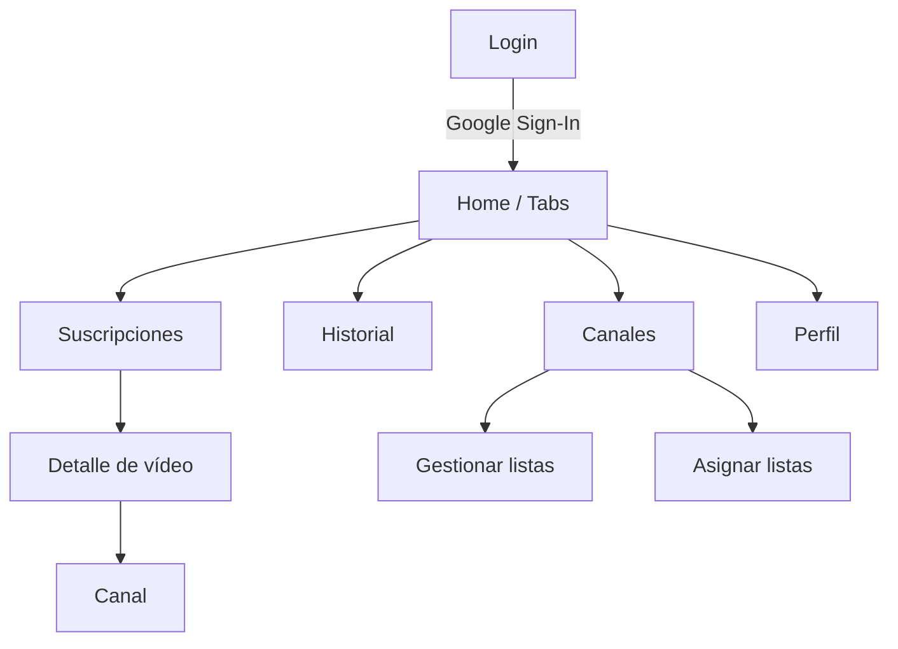

# ARIS

ARIS es una app Flutter para consultar tus suscripciones de YouTube, abrir el detalle de cada vídeo y generar resúmenes con IA, además de escuchar el contenido con un narrador (TTS).

**Funciones principales**
- Feed con el último vídeo de cada canal suscrito, ordenado por fecha.
- Detalle de vídeo con reproductor, transcripción, resumen IA y preguntas para profundizar.
- Narrador TTS configurable que lee resumen y preguntas.
- Página de canal con los últimos vídeos y paginación al hacer scroll.
- Listas locales de canales con iconos personalizados.
- Importar y exportar backups por SFTP en formato `.db`.

## Mapa visual de pantallas



## Páginas (tabla rápida)

| Pantalla | Qué muestra | Acciones clave | Archivo | Peticiones |
| --- | --- | --- | --- | --- |
| Login | Acceso con Google y estados de carga/error | Iniciar sesión | `lib/screens/login_screen.dart` | Petición 1: OAuth Google Sign‑In (tokens y scopes).<br>Ejemplo JSON: `{"accessToken":"ya29...","idToken":"...","expiresIn":3600}` |
| Home / Tabs | Contenedor con navegación y chips de cuota/coste | Cambiar pestañas, abrir perfil | `lib/main.dart` | Sin peticiones externas (datos locales).<br>Ejemplo JSON local: `{"quota_used":123,"ai_cost_micro":4500}` |
| Suscripciones | Lista de vídeos recientes | Refrescar, abrir detalle | `lib/screens/videos_screen.dart` | Se ejecutan 3‑4 peticiones: `subscriptions.list` (canales), `channels.list` (uploads), `playlistItems.list` (últimos vídeos), `videos.list` (duraciones).<br>Ejemplo JSON: `{"items":[{"snippet":{"title":"...","resourceId":{"videoId":"abc"}}}]}` |
| Historial | Vídeos reproducidos o con resumen pedido | Abrir detalle desde historial | `lib/screens/history_screen.dart` | Sin peticiones externas (SQLite).<br>Ejemplo JSON local: `{"video_id":"abc","watched_at":1700000000000,"summary_requested_at":1700000100000}` |
| Detalle de vídeo | Reproductor + resumen IA + preguntas | Elegir pista, resumir, narrar | `lib/screens/video_detail_screen.dart` | Petición 1: HTML YouTube (watch). Petición 2: `youtubei/v1/player` (pistas). Petición 3: descarga caption (XML). Petición 4: proveedor IA (resumen).<br>Ejemplo JSON: `{"resumen_inicial":"...","contenido_principal":"...","preguntas":["..."]}` |
| Canal | Últimos vídeos de un canal | Scroll infinito | `lib/screens/channel_videos_screen.dart` | Se ejecutan 2‑3 peticiones por página: `channels.list` (uploads, si no está), `playlistItems.list` (20 vídeos), `videos.list` (duraciones).<br>Ejemplo JSON: `{"items":[{"snippet":{"title":"...","resourceId":{"videoId":"abc"}}}],"nextPageToken":"..."}` |
| Canales | Suscripciones y listas locales | Crear/editar listas, asignar canales | `lib/screens/lists_screen.dart` | Se ejecutan 2 peticiones: `subscriptions.list` (paginado) + `channels.list` (snippet/contentDetails/statistics).<br>Ejemplo JSON: `{"items":[{"snippet":{"title":"Canal X","resourceId":{"channelId":"UC..."}}}]}` |
| Perfil | Configuración IA, voz TTS y SFTP | Guardar claves, importar/exportar | `lib/screens/profile_screen.dart` | Peticiones SFTP cuando importas/exportas (archivo `.db`, sin JSON HTTP).<br>Ejemplo JSON local: `{"provider":"ChatGPT","model":"gpt-5-mini","apiKey":"..."}` |

## Persistencia de datos (local)

La app usa **SQLite** con tablas dedicadas para costes, cuota y canales, además de un almacén clave‑valor para configuración y cachés. Toda la información se guarda en `aris.db`. El detalle de tablas y campos está en `docs/bbdd.md`.


## Cuota (estimada)

La app muestra una **cuota local estimada** para YouTube Data API. Es una referencia interna y no equivale a la cuota oficial de Google.

## Setup (Android)

1. Crea credenciales OAuth 2.0 para Android en Google Cloud Console. Usa el package name `com.aris` (o cambia `applicationId` en `android/app/build.gradle.kts`).
2. Obtén el SHA‑1 de tu keystore debug con:
   ```
   keytool -list -v -keystore %USERPROFILE%\.android\debug.keystore -alias androiddebugkey -storepass android -keypass android
   ```
3. Activa **YouTube Data API v3** en el mismo proyecto.
4. Descarga `google-services.json` y colócalo en `android/app/google-services.json`.
5. Crea un **Web OAuth Client ID** y, si quieres sobrescribir el ID embebido, ejecuta:
   ```
   flutter run --dart-define=GOOGLE_SERVER_CLIENT_ID=TU_WEB_CLIENT_ID
   ```

## Run

```
flutter pub get
flutter run
```

## Notas

- Google Sign-In está soportado en Android/iOS/Web. Windows desktop no está soportado.
